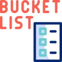
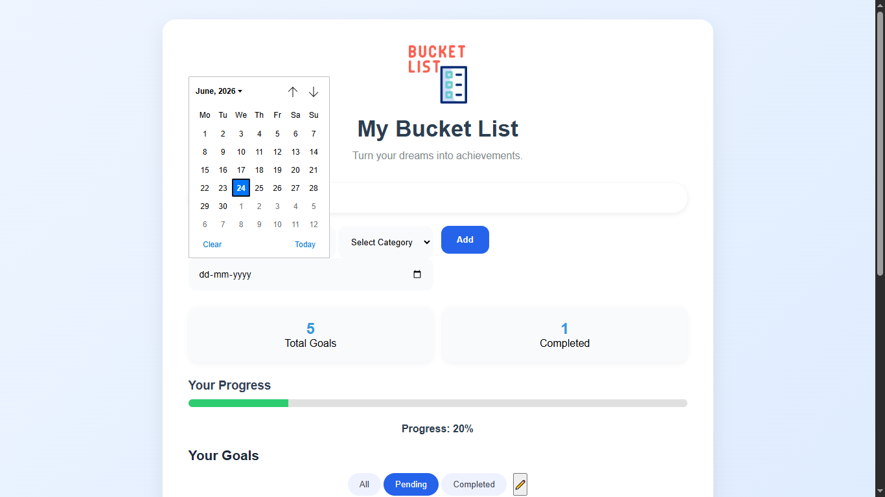

<div align="center">
  
  <br>
<h1>🌟 My Bucket List</h1>
</div>

## 📖 Description
A clean, responsive web application designed to help users track, categorize, and achieve their life goals. The app features a dynamic visual progress indicator, automatic deadline calculations, and local storage integration so your dreams are always saved directly in your browser. 

## 🚀 Live Preview
[Click here to view the live project](https://souravkrshaw21-alt.github.io/my-bucket-list/)) 

## 📸 Screenshots
### Desktop View


### Adding a Goal & Setting Deadlines
<p align="center">
  
  
</p>

### Mobile Responsive View & Edit Mode
<p align="center">
  
  
  
</p>

## ✨ Features
* **Goal Tracking:** Add new goals and assign them to specific categories (Travel, Career, Fitness, Learning, Personal).
* **Smart Deadlines:** Set target dates for your goals. The app automatically calculates and displays the days remaining in a clean, circular badge.
* **Dynamic Progress Bar:** A visual progress indicator updates in real-time as you complete tasks.
* **Filter & Search:** Quickly find specific goals using the search bar, or filter by "All", "Pending", and "Completed" statuses.
* **Edit Mode:** A dedicated toggle that securely reveals options to delete unwanted goals.
* **Local Storage:** Your bucket list is saved to your browser automatically. You won't lose your data when refreshing or closing the page.
* **Fully Responsive:** Carefully designed Flexbox layout that works flawlessly on desktop, tablet, and mobile screens.

## 🛠️ Technologies Used
* **HTML5:** Semantic structure and form elements.
* **CSS3:** Custom styling, Flexbox layout, animations, and responsive media queries.
* **JavaScript (Vanilla):** DOM manipulation, event handling, local storage integration, and native date formatting/calculations.

## 📁 Folder Structure
```text
my-bucket-list/
│
├── index.html          # Main HTML structure
├── style.css           # Custom styles and responsive layout
├── script.js           # Core logic, local storage, and interactivity
└── assets/             # Images and visual assets
    ├── logo.webp       # Project logo
    ├── screenshot01.jpg
    ├── screenshot02.jpg
    └── screenshot03.jpg
